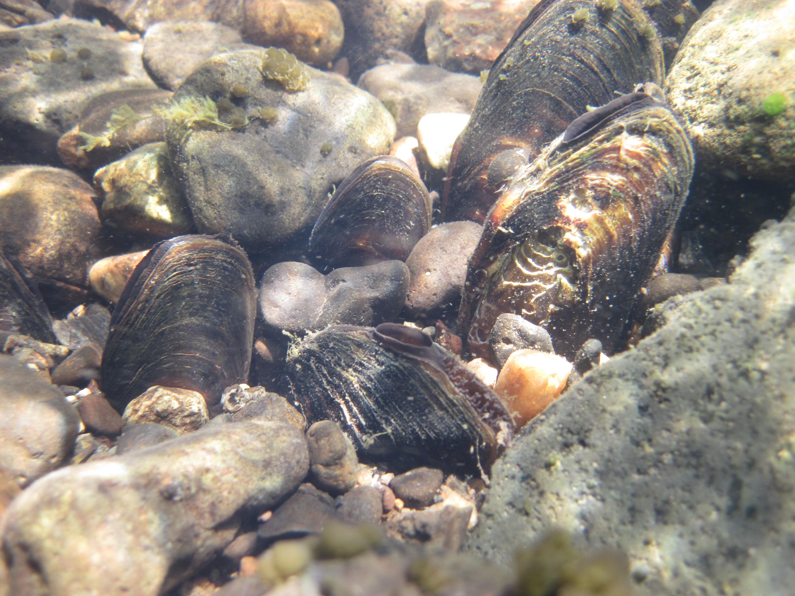
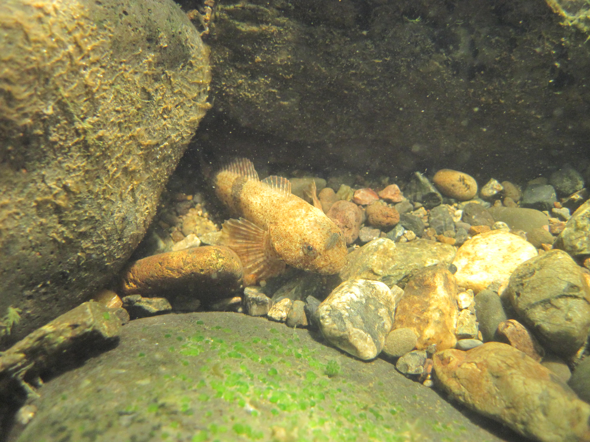
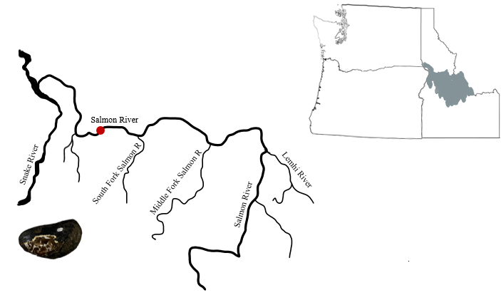
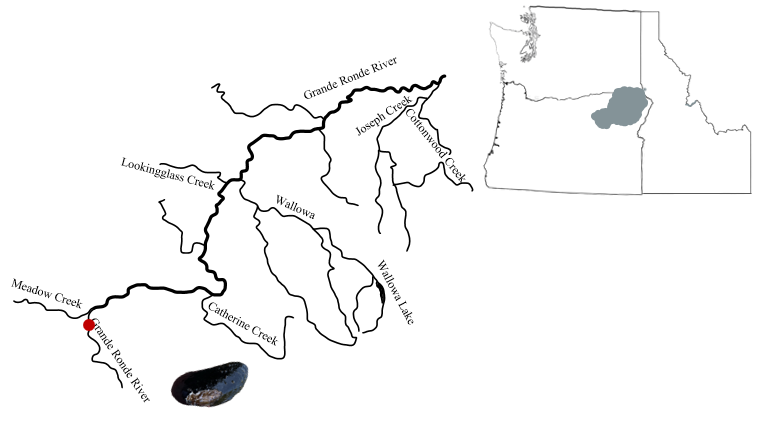
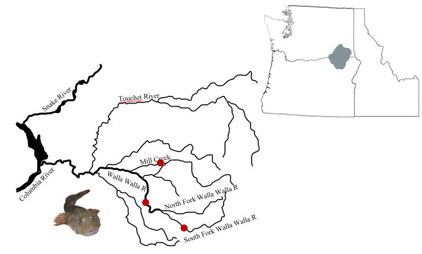
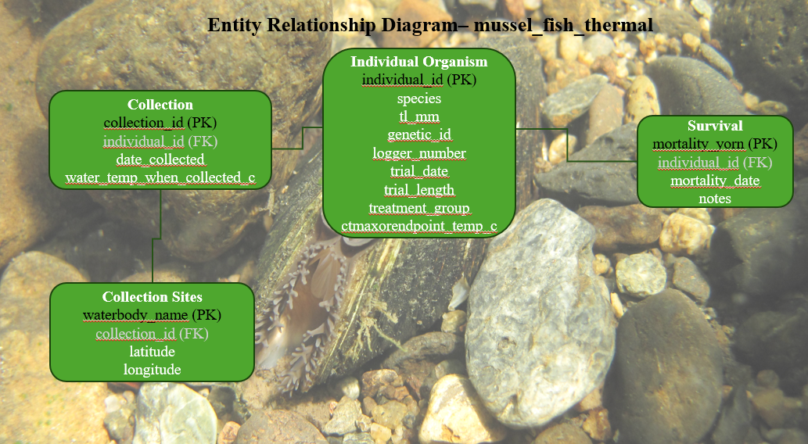

# Chapter 1: Background 
## Upper Thermal Tolerance of the Western Ridged Mussel (*Gonidea angulata*), Western Pearlshell (*Margaritifera falcata*), and Western Sculpin Species (*Cottus* spp.)

Freshwater mussels and fishes are heavily influenced by thermal stress and can only tolerate increasing temperatures until they reach their individual thermal maximum. Freshwater mussels are ecologically important as ecosystem engineers in aquatic systems and are a First Food (related to the tribal creation belief) for Columbia Plateau tribes like the Confederated Tribes of the Umatilla Indian Reservation (CTUIR). However, globally freshwater mussels have the highest extinction and imperilment rate compared to any other animal group on the planet. The Western Ridged Mussel (*Gonidea angulata*; Figure 1.1) and the Western Pearlshell (*Margaritifera falcata*; Figure 1.1) in particular have disappeared from areas in their historic range and are experiencing mass die-offs. To undergo metamorphosis to the juvenile life stage, *G. angulata* utilizes the gills of sculpins (*Cottus* spp.; Figure 1.2) and *M. falcata* uses the gills of salmonid species (*Oncorhynchus* spp.) to host their larval mussels. The purpose of this study was to determine upper thermal tolerances of adult *G. angulata* and *M. falcata*, and two sculpin species, Margined Sculpin (*C. marginatus*) and Paiute Sculpin (*C. beldingi*). Mussels were collected from the Salmon River, ID and Grande Ronde River, OR, and sculpins were collected from rivers near the Blue Mountains of southeastern WA and northeastern OR. Mussels and fish were transported to the CTUIR Aquatic Laboratory in Walla Walla, WA, where they were acclimated in 13°C water. Upper thermal tolerance was determined using acute and chronic tests. The acute test consisted of increasing the water temperature until critical thermal maximum (CTmax) behaviors were observed. The chronic test gradually increased the water temperature surrounding the test organism to an arbitrary 2°C below the CTmax determined for each species and maintained that temperature for seven days. Survival was recorded over the 7-day period. This document provides information on the database creation, exploration, and visualization of the collected data (mainly with the acute trials).

```{r mussel image, echo=FALSE, fig.align='center', fig.cap="Figure 1.1: Photo of both *G. angulata* (middle) and *M. falcata* (four surrounding) in the field.", out.width='100%'}

```

```{r sculpin image, echo=FALSE, fig.align='center', fig.cap="Figure 1.2: Photo of *Cottus* spp. in the field.", out.width='100%'}

```

## 1.1 Institution 
This research was conducted with the Confederated Tribes of the Umatilla Indian Reservation and the University of Idaho as Rachael Valeria's Masters thesis research.

## 1.2 Study Sites
The study sites were within the Columbia River Basin in the Salmon River, ID (Figure 1.3), Grande Ronde River, OR (Figure 1.4), and the Blue Mountains of southeastern WA and northeastern OR (Figure 1.5).

```{r WRM dis image, echo=FALSE, fig.cap="Figure 1.3: Sampling site location (red point) in the Salmon River, ID for *G. angulata*.", fig.align='center', out.width='100%'}

```

```{r WP dis image, echo=FALSE, fig.cap="Figure 1.4: Sampling site location (red point) in the Grande Ronde River, OR for *M. falcata*.", fig.align='center', out.width='100%'}

```

```{r sculpin dis image, echo=FALSE, fig.cap="Figure 1.5: Sampling site locations (red points) in the Walla Walla River Basin, OR and WA for *Cottus* spp.", fig.align='center', out.width='100%'}

```

# Chapter 2: Database Creation 
Thermal data and many aspects that may effect the thermal data was collected for this research including; information specific to the individual organism, the collection sites, and the temperature trials. To better organize and store this data, I have created a database design to use in R and SQLite.

```{r database image, echo=FALSE, fig.cap="Figure 2.1: Database diagram of columns and seperate tables. PK means primary key and FK means foreign key.", fig.align='center', out.width='100%'}

```

To recreate this database, simply execute the code below. Note: each specific table is distinguished by the top title in each box above and each of the names under that title are the enclosed columns.

## 2.1 Install and load required packages and initate database creation 
Load the DBI package into R and initiate a connection between R and SQLite to create the database file in SQLite through R.
```{r eval=FALSE, include=TRUE}
install.packages(DBI)
install.packages(RSQLite)
install.packages(tidyverse)
```

```{r include=TRUE}
#Download packages
library(DBI)
library(RSQLite)
library(tidyverse)

# Establish connection with database
FinalProject_db <-dbConnect(RSQLite::SQLite(), "FinalProject.db")
```

## 2.2 Create Individual Organism table 
The individual_organism table includes the following columns: individual_id (primary key), species, total length in mm, genetic_id (for sculpin species), logger_number, trial_date, trial_length (acute or chronic), treatment_group (treatment or control), and CTmax or endpoint temperature in Celsius. 
```{r eval=FALSE, include=TRUE}
#Create individual_organism table in sql through r
dbExecute(FinalProject_db, "CREATE TABLE individual_organism (
individual_id varchar(6),
species varchar(20),
tl_mm varchar(4),
genetic_id varchar(3),
logger_number varchar(10),
trial_date varchar(10),
trial_length varchar(8),
treatment_group varchar(10),
ctmaxorendpoint_temp_c varchar(6),
PRIMARY KEY (individual_id)
);")
```

## 2.3 Create Collection table
The collection table includes the following columns;collection_id (primary key), individual_id (foreign key), date_collected, and water temperature when collected in degrees Celsius.
```{r eval=FALSE, include=TRUE}
#Create collection table in sql through r
dbExecute(FinalProject_db, "CREATE TABLE survival (
mortality_yorn char(1),
individual_id varchar(6),
mortality_date varchar(10),
notes varchar(30),
PRIMARY KEY (mortality_yorn)
);")
```

## 2.4 Create Collection Sites table
The collection_sites table includes the following columns; waterbody_name (primary key), collection_id (foreign key), latitude, and longitude.
```{r eval=FALSE, include=TRUE}
#Create collection_sites table in sql through r
dbExecute(FinalProject_db, "CREATE TABLE collection_sites (
waterbody_name varchar(30),
collection_id varchar(6),
latitude varchar(11),
longitude varchar(11),
PRIMARY KEY (waterbody_name)
);") 
```

## 2.5 Create survival table'
The survival table includes the following columns; mortality (yes or no; primary key), individual_id (foreign key), mortality_date, and notes.
```{r eval=FALSE, include=TRUE}
#Create survival table in sql through r
dbExecute(FinalProject_db, "CREATE TABLE survival (
mortality_yorn char(1),
individual_id varchar(6),
mortality_date varchar(10),
notes varchar(30),
PRIMARY KEY (mortality_yorn)
);")
```

# Chapter 3: Input Data

## 3.1 Load data into individual organism table
```{r eval=FALSE, include=TRUE}
#Load csv of data into individual_organism table 
dbWriteTable(FinalProject_db, "individual_organism", 
             individual_organism %>%
               select(
                 species,
                 tl_mm,
                 genetic_id,
                 logger_number,
                 trial_date,
                 trial_length,
                 treatment_group,
                 ctmaxorendpoint_temp_c,
             append = TRUE))
```

```{r echo=TRUE}
#Check data in individual_organism table
dbGetQuery(FinalProject_db, "SELECT * FROM individual_organism LIMIT 5;")
```

## 3.2 Load data into collection table
```{r eval=FALSE, include=TRUE}
# Load csv of data into collection table
dbWriteTable(FinalProject_db, "collection",
             collection %>%
               select(
                 collection_id,
                 individual_id,
                 date_collected,
                 water_temp_when_collected_c,
                 append = TRUE))

```

```{r echo=TRUE}
#Check data in collection table
dbGetQuery(FinalProject_db, "SELECT * FROM collection LIMIT 5;")
```

## 3.3 Load data into collection sites table
```{r eval=FALSE, include=TRUE}
# Load csv of data into collection_sites table
dbWriteTable(FinalProject_db, "collection_sites",
             collection %>%
               select(
                 waterbody_name,
                 collection_id,
                 latitude,
                 longitude,
                 append = TRUE))
```

```{r echo=TRUE}
#Check data in collection_sites table
dbGetQuery(FinalProject_db, "SELECT * FROM collection_sites LIMIT 5;")
```

## 3.4 Load data into survival table
```{r eval=FALSE, include=TRUE}
# Load csv of data into survival table
dbWriteTable(FinalProject_db, "survival",
             survival %>%
               select(
                 mortality_yorn,
                 individual_id,
                 mortality_date,
                 notes,
                 append = TRUE))
```

```{r echo=TRUE}
#Check data in survival table
dbGetQuery(FinalProject_db, "SELECT * FROM survival LIMIT 5;")
```

# Chapter 4: Data Exploration
Steps/goals for data exploration: 
1. Load packages and connect to database
2. Load all data from database tables
3. Make temperatures in ctmaxorendpoint_temp_c column numeric 
4. Find the average CTmax temperatures by species
5. Find the average endpoint temperatures by species
6. Find the minimum and maximum CTmax temperatures by species
7. Find the minimum and maximum endpoint temperatures by species

## 4.1 Load and format data
```{r}
#Load packages
library(tidyverse)
library(DBI)

#Connect to database
FinalProject_db <-dbConnect(RSQLite::SQLite(), "FinalProject.db")

#Get all data from individual_organism table
individual_organism<-dbGetQuery(conn = FinalProject_db,
                          statement = "SELECT * FROM individual_organism;")

#Get all data from the collection table
collection <-dbGetQuery(conn =FinalProject_db,
                        statement = "SELECT * FROM collection;")

#Get all data from the collection_sites table
collection_sites <-dbGetQuery(conn =FinalProject_db,
                              statement = "SELECT * FROM collection_sites;")

#Get all data from the survival table
survival <-dbGetQuery(conn =FinalProject_db,
                      statement = "SELECT * FROM survival;")

#Make CTmax/endpoint temperatures numeric
individual_organism$ctmaxorendpoint_temp_c <- as.numeric(as.character(individual_organism$ctmaxorendpoint_temp_c))
individual_organism <- individual_organism[!is.na(individual_organism$ctmaxorendpoint_temp_c) & 
                                             !is.infinite(individual_organism$ctmaxorendpoint_temp_c), ]

```

## 4.2: Average CTmax temperatures of treatment groups by species (acute)
```{r echo=TRUE}
#Find averages of CTmax temperatures for treatment groups by species (acute)
individual_organism |>
drop_na(ctmaxorendpoint_temp_c) |>
filter(ctmaxorendpoint_temp_c >= 16) |>
group_by(species) |>
summarize(ctmaxorendpoint_temp_c = mean(ctmaxorendpoint_temp_c))
```

## 4.3: Average endpoint temperatures of control groups by species (acute)
```{r echo=TRUE}
#Find averages of endpoint temperatures in control groups by species (acute)
individual_organism |>
  drop_na(ctmaxorendpoint_temp_c) |>
  filter(ctmaxorendpoint_temp_c <= 16) |>
  group_by(species) |>
  summarize(ctmaxorendpoint_temp_c = mean(ctmaxorendpoint_temp_c))
```

## 4.5 Minimum CTmax temperatures in treatment groups by species
```{r echo=TRUE}
#Find minimum of CTmax temperatures in treatment groups by species (acute)
individual_organism |>
  drop_na(ctmaxorendpoint_temp_c) |>
  filter(ctmaxorendpoint_temp_c >= 16) |>
  group_by(species) |>
  summarize(ctmaxorendpoint_temp_c = min(ctmaxorendpoint_temp_c))

```

## 4.6 Maximum CTmax temperatures in treatment groups by species
```{r echo=TRUE}
#Find maximum of CTmax temperatures in treatment groups by species (acute)
individual_organism |>
  drop_na(ctmaxorendpoint_temp_c) |>
  filter(ctmaxorendpoint_temp_c >= 16) |>
  group_by(species) |>
  summarize(ctmaxorendpoint_temp_c = max(ctmaxorendpoint_temp_c))
```

## 4.7 Minimum endpoint temperatures in control groups by species
```{r echo=TRUE}
#Find minimum endpoint temperatures in control groups by species (acute)
individual_organism |>
  drop_na(ctmaxorendpoint_temp_c) |>
  filter(ctmaxorendpoint_temp_c <= 16) |>
  group_by(species) |>
  summarize(ctmaxorendpoint_temp_c = min(ctmaxorendpoint_temp_c))

```

## 4.8 Maximum endpoint temperatures in control groups by species
```{r echo=TRUE}
#Find maximum endpoint temperatures in control groups by species (acute)
individual_organism |>
  drop_na(ctmaxorendpoint_temp_c) |>
  filter(ctmaxorendpoint_temp_c <= 16) |>
  group_by(species) |>
  summarize(ctmaxorendpoint_temp_c = max(ctmaxorendpoint_temp_c))
```

# Chapter 5: Visualizations (Scatterplots)

## 5.1 Install and load packages needed 
```{r eval=FALSE, include=TRUE}
#Install packages
install.packages(ggplot2)
install.packages(scales)
```

```{r}
#Load packages
library(ggplot2)
library(scales)
```

## 5.2 Create a scatterplot of CTmax or endpoint temperature in C by species (acute)
## Format y axis (ctmaxorendpoint_temp_c)
```{r}
#Make the y axis (ctmaxorendpoint_temp_c) numeric
individual_organism$ctmaxorendpoint_temp_c <- as.numeric(as.character(individual_organism$ctmaxorendpoint_temp_c))
individual_organism <- individual_organism[!is.na(individual_organism$ctmaxorendpoint_temp_c) & 
                                             !is.infinite(individual_organism$ctmaxorendpoint_temp_c), ]
#Format with spacing and sequence
scale_y_continuous(breaks = seq(0,max(individual_organism$ctmaxorendpoint_temp_c, length.out = 5)))
```

## Create the scatterplot
```{r echo=TRUE, fig.align='center', out.width='100%', fig.cap= "Figure 5.1: CTmax and endpoint temperature in the acute study by species. Each point represents are individual organism. Colors represent treatment group."}
#Scatterplot of species and CTmax/endpoint temperature
ggplot(individual_organism, aes(x = species, y = ctmaxorendpoint_temp_c, 
                                color = treatment_group)) +   
  geom_point() +
  theme_bw() +
theme (axis.text.y = element_text(size = 10)) +
labs(x = "Mussel/Fish Species", y = "CTmax or Endpoint Temperature (C)",
      color = "Treatment", shape = "Trial Length") 
```

## 5.3 Create a scatterplot of CTmax or endpoint temperature in C by total length in mm (acute)
## Format x axis (tl_mm) as well
```{r}
#Make x axis (tl_mm) numeric as well
individual_organism$tl_mm <- as.numeric(as.character(individual_organism$tl_mm))
individual_organism <- individual_organism[!is.na(individual_organism$tl_mm) & 
                                             !is.infinite(individual_organism$tl_mm), ]
scale_y_continuous(breaks = seq(0,max(individual_organism$tl_mm, length.out = 10)))
```

## Create the scatterplot
```{r echo=TRUE, fig.align='center', out.width='100%', fig.cap= "Figure 5.2: CTmax and endpoint temperature by total length in the acute study. Each point represents are individual organism. Colors represent different species and shapes represent the treatment group."}
#Scatterplot of total length and CTmax/endpoint temperature
ggplot(individual_organism, aes(x = tl_mm, y = ctmaxorendpoint_temp_c, 
                                color = species, shape = treatment_group)) +   
  geom_point() +
  theme_bw() +
  theme (axis.text.y = element_text(size = 10),
  axis.text.x = element_text(size = 10, angle = 90)) +
  labs(x = "Total Length (mm)", y = "CTmax or Endpoint Temperature (C)",
       color = "Mussel/Fish Species", shape = "Treatment")
```

